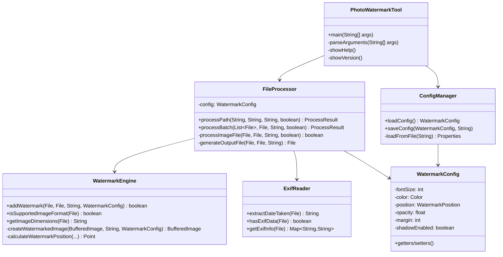
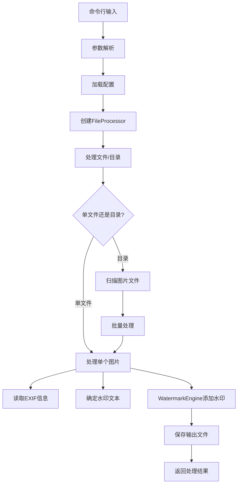

# Photo Watermark Tool - 开发者指南

本指南面向希望参与 Photo Watermark Tool 开发的开发者，包含项目结构、开发规范、测试指南和贡献流程。

## 目录

- [项目概述](#项目概述)
- [开发环境设置](#开发环境设置)
- [项目结构](#项目结构)
- [核心架构](#核心架构)
- [开发规范](#开发规范)
- [测试指南](#测试指南)
- [构建和部署](#构建和部署)
- [贡献指南](#贡献指南)
- [发布流程](#发布流程)

---

## 项目概述

### 技术栈

- **语言**: Java 8+
- **构建工具**: Maven 3.6+
- **测试框架**: JUnit 5
- **图像处理**: Java AWT/BufferedImage
- **EXIF处理**: metadata-extractor
- **日志**: SLF4J + Logback
- **命令行解析**: 自定义实现

### 设计原则

1. **单一职责**: 每个类专注于一个特定功能
2. **开闭原则**: 对扩展开放，对修改封闭
3. **依赖倒置**: 依赖抽象而非具体实现
4. **接口隔离**: 提供简洁明确的API接口
5. **错误处理**: 优雅的异常处理和用户友好的错误信息

---

## 开发环境设置

### 必需工具

```bash
# Java 开发环境
java -version  # 需要 Java 8+
javac -version

# Maven 构建工具
mvn -version   # 需要 Maven 3.6+

# Git 版本控制
git --version
```

### IDE 推荐配置

#### IntelliJ IDEA
```xml
<!-- .idea/codeStyles/Project.xml -->
<component name="ProjectCodeStyleConfiguration">
  <code_scheme name="Project" version="173">
    <JavaCodeStyleSettings>
      <option name="INDENT_SIZE" value="4" />
      <option name="TAB_SIZE" value="4" />
      <option name="USE_TAB_CHARACTER" value="false" />
    </JavaCodeStyleSettings>
  </code_scheme>
</component>
```

#### Eclipse
```properties
# .settings/org.eclipse.jdt.core.prefs
eclipse.preferences.version=1
org.eclipse.jdt.core.formatter.tabulation.char=space
org.eclipse.jdt.core.formatter.tabulation.size=4
```

### 项目克隆和设置

```bash
# 克隆项目
git clone https://github.com/your-username/Photo-Watermark-1.git
cd Photo-Watermark-1

# 安装依赖
mvn clean install

# 运行测试
mvn test

# 启动开发模式
mvn compile exec:java -Dexec.mainClass="com.photowatermark.PhotoWatermarkTool"
```

---

## 项目结构

### 目录结构

```
Photo-Watermark-1/
├── src/
│   ├── main/
│   │   ├── java/com/photowatermark/
│   │   │   ├── PhotoWatermarkTool.java      # 主程序入口
│   │   │   ├── core/                        # 核心功能模块
│   │   │   │   ├── WatermarkEngine.java     # 水印绘制引擎
│   │   │   │   ├── FileProcessor.java       # 文件批量处理
│   │   │   │   └── ExifReader.java          # EXIF信息读取
│   │   │   ├── config/                      # 配置管理模块
│   │   │   │   ├── ConfigManager.java       # 配置管理器
│   │   │   │   ├── WatermarkConfig.java     # 水印配置类
│   │   │   │   └── WatermarkPosition.java   # 位置枚举
│   │   │   └── util/                        # 工具类模块
│   │   │       ├── ProcessResult.java       # 处理结果类
│   │   │       └── ColorUtils.java          # 颜色工具类
│   │   └── resources/
│   │       ├── watermark.properties         # 默认配置
│   │       └── logback.xml                  # 日志配置
│   └── test/
│       └── java/com/photowatermark/
│           ├── WatermarkEngineTest.java     # 水印引擎测试
│           ├── FileProcessorTest.java       # 文件处理测试
│           ├── ExifReaderTest.java          # EXIF读取测试
│           └── ConfigManagerTest.java       # 配置管理测试
├── docs/                                    # 文档目录
│   ├── API.md                              # API文档
│   ├── USER_GUIDE.md                       # 用户指南
│   └── DEVELOPER_GUIDE.md                  # 开发者指南
├── scripts/                                # 构建脚本
│   ├── build.sh                           # 构建脚本
│   └── release.sh                         # 发布脚本
├── pom.xml                                 # Maven配置
├── README.md                               # 项目说明
├── LICENSE                                 # 许可证
└── .gitignore                             # Git忽略文件
```

### 模块说明

#### 核心模块 (core)
- **WatermarkEngine**: 负责图像水印的绘制和渲染
- **FileProcessor**: 处理文件和目录的批量操作
- **ExifReader**: 读取和解析图片的EXIF元数据

#### 配置模块 (config)
- **ConfigManager**: 管理配置文件的加载和保存
- **WatermarkConfig**: 水印配置的数据模型
- **WatermarkPosition**: 水印位置的枚举定义

#### 工具模块 (util)
- **ProcessResult**: 批量处理结果的封装
- **ColorUtils**: 颜色处理的工具方法

---

## 核心架构

### 类图关系



### 数据流



---

## 开发规范

### 代码风格

#### Java 编码规范

```java
// 类名：大驼峰命名法
public class WatermarkEngine {
    
    // 常量：全大写，下划线分隔
    private static final String DEFAULT_FONT_NAME = "SansSerif";
    private static final int MAX_FONT_SIZE = 200;
    
    // 成员变量：小驼峰命名法，私有
    private WatermarkConfig config;
    private Logger logger;
    
    // 方法名：小驼峰命名法，动词开头
    public boolean addWatermark(File inputFile, File outputFile, 
                               String watermarkText, WatermarkConfig config) {
        // 参数验证
        if (inputFile == null || !inputFile.exists()) {
            logger.error("输入文件无效: {}", inputFile);
            return false;
        }
        
        // 业务逻辑
        try {
            BufferedImage image = ImageIO.read(inputFile);
            // ... 处理逻辑
            return true;
        } catch (IOException e) {
            logger.error("处理图片时发生错误", e);
            return false;
        }
    }
}
```

#### 注释规范

```java
/**
 * 水印绘制引擎
 * 
 * <p>提供图片水印添加的核心功能，支持多种水印样式和位置配置。
 * 
 * @author PhotoWatermark Team
 * @version 1.0.0
 * @since 1.0.0
 */
public class WatermarkEngine {
    
    /**
     * 为图片添加水印
     * 
     * @param inputFile 输入图片文件，不能为null且必须存在
     * @param outputFile 输出图片文件，不能为null
     * @param watermarkText 水印文本，不能为空
     * @param config 水印配置，不能为null
     * @return 是否成功添加水印
     * @throws IllegalArgumentException 当参数无效时抛出
     */
    public boolean addWatermark(File inputFile, File outputFile, 
                               String watermarkText, WatermarkConfig config) {
        // 实现代码...
    }
}
```

### 异常处理

#### 异常处理原则

```java
public class FileProcessor {
    
    // 1. 使用具体的异常类型
    public ProcessResult processPath(String inputPath) throws IOException {
        if (inputPath == null || inputPath.trim().isEmpty()) {
            throw new IllegalArgumentException("输入路径不能为空");
        }
        
        File inputFile = new File(inputPath);
        if (!inputFile.exists()) {
            throw new FileNotFoundException("输入路径不存在: " + inputPath);
        }
        
        // 2. 记录异常信息
        try {
            return doProcess(inputFile);
        } catch (IOException e) {
            logger.error("处理文件时发生IO错误: {}", inputPath, e);
            throw e; // 重新抛出，让调用者处理
        } catch (Exception e) {
            logger.error("处理文件时发生未知错误: {}", inputPath, e);
            throw new RuntimeException("处理失败", e);
        }
    }
    
    // 3. 优雅降级
    private String determineWatermarkText(String customText, boolean useExif, File imageFile) {
        if (customText != null && !customText.trim().isEmpty()) {
            return customText;
        }
        
        if (useExif) {
            try {
                String exifDate = ExifReader.extractDateTaken(imageFile);
                if (exifDate != null) {
                    return exifDate;
                }
            } catch (Exception e) {
                logger.warn("读取EXIF信息失败，使用默认水印: {}", imageFile.getName(), e);
            }
        }
        
        // 降级到默认值
        return config.getDefaultWatermarkText();
    }
}
```

### 日志规范

```java
public class WatermarkEngine {
    private static final Logger logger = LoggerFactory.getLogger(WatermarkEngine.class);
    
    public boolean addWatermark(File inputFile, File outputFile, 
                               String watermarkText, WatermarkConfig config) {
        // DEBUG: 详细的调试信息
        logger.debug("开始处理图片: {} -> {}", inputFile.getName(), outputFile.getName());
        logger.debug("水印配置: 字体大小={}, 位置={}, 透明度={}", 
                    config.getFontSize(), config.getPosition(), config.getOpacity());
        
        try {
            BufferedImage image = ImageIO.read(inputFile);
            
            // INFO: 重要的业务信息
            logger.info("成功为图片 {} 添加水印，输出到: {}", 
                       inputFile.getName(), outputFile.getName());
            
            return true;
            
        } catch (IOException e) {
            // ERROR: 错误信息，包含异常堆栈
            logger.error("处理图片时发生IO错误: {}", inputFile.getName(), e);
            return false;
        }
    }
}
```

---

## 测试指南

### 测试结构

```java
@TestMethodOrder(OrderAnnotation.class)
class WatermarkEngineTest {
    
    @TempDir
    Path tempDir;
    
    private File testImageFile;
    private File outputFile;
    private WatermarkConfig config;
    
    @BeforeEach
    void setUp() throws IOException {
        // 创建测试图片
        testImageFile = createTestImage("test.jpg", 200, 200);
        outputFile = tempDir.resolve("output.jpg").toFile();
        
        // 创建测试配置
        config = new WatermarkConfig();
        config.setFontSize(24);
        config.setColor(Color.BLACK);
        config.setPosition(WatermarkPosition.BOTTOM_RIGHT);
    }
    
    @Test
    @Order(1)
    @DisplayName("正常情况下添加水印应该成功")
    void testAddWatermarkWithValidInputs() {
        boolean result = WatermarkEngine.addWatermark(
            testImageFile, outputFile, "Test Watermark", config
        );
        
        assertAll(
            () -> assertTrue(result, "添加水印应该成功"),
            () -> assertTrue(outputFile.exists(), "输出文件应该存在"),
            () -> assertTrue(outputFile.length() > 0, "输出文件应该有内容")
        );
    }
    
    @ParameterizedTest
    @ValueSource(strings = {"", "   ", "\t", "\n"})
    @DisplayName("空白水印文本应该失败")
    void testAddWatermarkWithBlankText(String watermarkText) {
        boolean result = WatermarkEngine.addWatermark(
            testImageFile, outputFile, watermarkText, config
        );
        
        assertFalse(result, "空白水印文本应该失败");
    }
    
    // 辅助方法
    private File createTestImage(String filename, int width, int height) throws IOException {
        BufferedImage image = new BufferedImage(width, height, BufferedImage.TYPE_INT_RGB);
        Graphics2D g2d = image.createGraphics();
        g2d.setColor(Color.WHITE);
        g2d.fillRect(0, 0, width, height);
        g2d.dispose();
        
        File imageFile = tempDir.resolve(filename).toFile();
        ImageIO.write(image, "jpg", imageFile);
        return imageFile;
    }
}
```

### 测试分类

#### 单元测试
```bash
# 运行所有单元测试
mvn test

# 运行特定测试类
mvn test -Dtest=WatermarkEngineTest

# 运行特定测试方法
mvn test -Dtest=WatermarkEngineTest#testAddWatermarkWithValidInputs
```

#### 集成测试
```java
@TestMethodOrder(OrderAnnotation.class)
class IntegrationTest {
    
    @Test
    @Order(1)
    void testCompleteWorkflow() throws IOException {
        // 准备测试数据
        Path testDir = createTestPhotoDirectory();
        
        // 执行完整流程
        String[] args = {
            "-i", testDir.toString(),
            "-o", tempDir.resolve("output").toString(),
            "-t", "集成测试水印",
            "--font-size", "20"
        };
        
        // 验证结果
        PhotoWatermarkTool.main(args);
        
        // 检查输出
        File outputDir = tempDir.resolve("output").toFile();
        File[] outputFiles = outputDir.listFiles();
        
        assertThat(outputFiles).hasSize(3); // 假设有3个测试图片
        Arrays.stream(outputFiles).forEach(file -> {
            assertTrue(file.exists());
            assertTrue(file.length() > 0);
        });
    }
}
```

### 性能测试

```java
@Test
@Timeout(value = 5, unit = TimeUnit.SECONDS)
void testPerformanceWithLargeImage() throws IOException {
    // 创建大图片 (4K)
    File largeImage = createTestImage("large.jpg", 3840, 2160);
    
    long startTime = System.currentTimeMillis();
    
    boolean result = WatermarkEngine.addWatermark(
        largeImage, outputFile, "性能测试", config
    );
    
    long endTime = System.currentTimeMillis();
    long duration = endTime - startTime;
    
    assertTrue(result);
    assertTrue(duration < 3000, "处理4K图片应该在3秒内完成，实际耗时: " + duration + "ms");
}
```

---

## 构建和部署

### Maven 配置

```xml
<!-- pom.xml 关键配置 -->
<properties>
    <maven.compiler.source>8</maven.compiler.source>
    <maven.compiler.target>8</maven.compiler.target>
    <project.build.sourceEncoding>UTF-8</project.build.sourceEncoding>
    <junit.version>5.8.2</junit.version>
</properties>

<build>
    <plugins>
        <!-- 编译插件 -->
        <plugin>
            <groupId>org.apache.maven.plugins</groupId>
            <artifactId>maven-compiler-plugin</artifactId>
            <version>3.8.1</version>
            <configuration>
                <source>8</source>
                <target>8</target>
            </configuration>
        </plugin>
        
        <!-- 测试插件 -->
        <plugin>
            <groupId>org.apache.maven.plugins</groupId>
            <artifactId>maven-surefire-plugin</artifactId>
            <version>3.0.0-M7</version>
        </plugin>
        
        <!-- 打包插件 -->
        <plugin>
            <groupId>org.apache.maven.plugins</groupId>
            <artifactId>maven-shade-plugin</artifactId>
            <version>3.2.4</version>
            <executions>
                <execution>
                    <phase>package</phase>
                    <goals>
                        <goal>shade</goal>
                    </goals>
                    <configuration>
                        <transformers>
                            <transformer implementation="org.apache.maven.plugins.shade.resource.ManifestResourceTransformer">
                                <mainClass>com.photowatermark.PhotoWatermarkTool</mainClass>
                            </transformer>
                        </transformers>
                    </configuration>
                </execution>
            </executions>
        </plugin>
    </plugins>
</build>
```

### 构建脚本

```bash
#!/bin/bash
# scripts/build.sh

set -e

echo "开始构建 Photo Watermark Tool..."

# 清理
echo "清理旧的构建文件..."
mvn clean

# 编译
echo "编译源代码..."
mvn compile

# 运行测试
echo "运行测试..."
mvn test

# 打包
echo "打包应用..."
mvn package

# 验证
echo "验证构建结果..."
if [ -f "target/photo-watermark-tool.jar" ]; then
    echo "✅ 构建成功！"
    echo "📦 输出文件: target/photo-watermark-tool.jar"
    
    # 显示文件信息
    ls -lh target/photo-watermark-tool.jar
    
    # 测试运行
    echo "🧪 测试运行..."
    java -jar target/photo-watermark-tool.jar --version
else
    echo "❌ 构建失败！"
    exit 1
fi
```

### CI/CD 配置

```yaml
# .github/workflows/ci.yml
name: CI/CD Pipeline

on:
  push:
    branches: [ main, develop ]
  pull_request:
    branches: [ main ]

jobs:
  test:
    runs-on: ubuntu-latest
    
    strategy:
      matrix:
        java-version: [8, 11, 17]
    
    steps:
    - uses: actions/checkout@v3
    
    - name: Set up JDK ${{ matrix.java-version }}
      uses: actions/setup-java@v3
      with:
        java-version: ${{ matrix.java-version }}
        distribution: 'temurin'
    
    - name: Cache Maven dependencies
      uses: actions/cache@v3
      with:
        path: ~/.m2
        key: ${{ runner.os }}-m2-${{ hashFiles('**/pom.xml') }}
    
    - name: Run tests
      run: mvn clean test
    
    - name: Generate test report
      run: mvn surefire-report:report
    
    - name: Upload test results
      uses: actions/upload-artifact@v3
      if: always()
      with:
        name: test-results-java-${{ matrix.java-version }}
        path: target/surefire-reports/

  build:
    needs: test
    runs-on: ubuntu-latest
    
    steps:
    - uses: actions/checkout@v3
    
    - name: Set up JDK 8
      uses: actions/setup-java@v3
      with:
        java-version: '8'
        distribution: 'temurin'
    
    - name: Build application
      run: mvn clean package
    
    - name: Upload artifacts
      uses: actions/upload-artifact@v3
      with:
        name: photo-watermark-tool
        path: target/photo-watermark-tool.jar
```

---

## 贡献指南

### 贡献流程

1. **Fork 项目**
   ```bash
   # 在 GitHub 上 Fork 项目
   git clone https://github.com/your-username/Photo-Watermark-1.git
   cd Photo-Watermark-1
   ```

2. **创建功能分支**
   ```bash
   git checkout -b feature/new-watermark-style
   ```

3. **开发和测试**
   ```bash
   # 编写代码
   # 添加测试
   mvn test
   ```

4. **提交更改**
   ```bash
   git add .
   git commit -m "feat: 添加新的水印样式支持"
   ```

5. **推送和创建 PR**
   ```bash
   git push origin feature/new-watermark-style
   # 在 GitHub 上创建 Pull Request
   ```

### 提交信息规范

使用 [Conventional Commits](https://www.conventionalcommits.org/) 规范：

```
<type>[optional scope]: <description>

[optional body]

[optional footer(s)]
```

**类型说明：**
- `feat`: 新功能
- `fix`: 错误修复
- `docs`: 文档更新
- `style`: 代码格式调整
- `refactor`: 代码重构
- `test`: 测试相关
- `chore`: 构建过程或辅助工具的变动

**示例：**
```
feat(watermark): 添加渐变色水印支持

- 新增 GradientWatermarkStyle 类
- 支持线性和径向渐变
- 添加相关配置选项

Closes #123
```

### 代码审查清单

#### 功能性
- [ ] 功能按预期工作
- [ ] 边界条件处理正确
- [ ] 错误处理完善
- [ ] 性能影响可接受

#### 代码质量
- [ ] 代码风格符合项目规范
- [ ] 命名清晰有意义
- [ ] 注释充分且准确
- [ ] 没有重复代码

#### 测试
- [ ] 单元测试覆盖新功能
- [ ] 测试用例充分
- [ ] 所有测试通过
- [ ] 集成测试正常

#### 文档
- [ ] API 文档更新
- [ ] 用户指南更新
- [ ] 变更日志记录

---

## 发布流程

### 版本号规范

使用 [Semantic Versioning](https://semver.org/)：

- **MAJOR**: 不兼容的 API 变更
- **MINOR**: 向后兼容的功能新增
- **PATCH**: 向后兼容的错误修复

### 发布步骤

```bash
#!/bin/bash
# scripts/release.sh

VERSION=$1
if [ -z "$VERSION" ]; then
    echo "使用方法: $0 <version>"
    echo "示例: $0 1.2.0"
    exit 1
fi

echo "准备发布版本 $VERSION..."

# 1. 更新版本号
mvn versions:set -DnewVersion=$VERSION
mvn versions:commit

# 2. 运行完整测试
mvn clean test

# 3. 构建发布包
mvn clean package

# 4. 创建发布标签
git add .
git commit -m "chore: 发布版本 $VERSION"
git tag -a "v$VERSION" -m "Release version $VERSION"

# 5. 推送到远程
git push origin main
git push origin "v$VERSION"

echo "✅ 版本 $VERSION 发布完成！"
```

### 发布检查清单

- [ ] 所有测试通过
- [ ] 文档更新完成
- [ ] 变更日志记录
- [ ] 版本号正确
- [ ] 构建成功
- [ ] 标签创建
- [ ] GitHub Release 创建

---

## 常见开发问题

### Q1: 如何添加新的水印样式？

**A:** 扩展 WatermarkEngine 类：

```java
// 1. 在 WatermarkConfig 中添加新配置
public enum WatermarkStyle {
    SIMPLE, GRADIENT, SHADOW, OUTLINE
}

// 2. 在 WatermarkEngine 中添加处理逻辑
private static void applyWatermarkStyle(Graphics2D g2d, WatermarkConfig config) {
    switch (config.getStyle()) {
        case GRADIENT:
            applyGradientStyle(g2d, config);
            break;
        case SHADOW:
            applyShadowStyle(g2d, config);
            break;
        // ...
    }
}
```

### Q2: 如何优化大图片处理性能？

**A:** 几种优化策略：

```java
// 1. 图片缩放处理
private static BufferedImage scaleImageIfNeeded(BufferedImage image, int maxSize) {
    if (image.getWidth() > maxSize || image.getHeight() > maxSize) {
        double scale = Math.min(
            (double) maxSize / image.getWidth(),
            (double) maxSize / image.getHeight()
        );
        
        int newWidth = (int) (image.getWidth() * scale);
        int newHeight = (int) (image.getHeight() * scale);
        
        return scaleImage(image, newWidth, newHeight);
    }
    return image;
}

// 2. 并行处理
public ProcessResult processBatch(List<File> files, ...) {
    return files.parallelStream()
        .map(file -> processImageFile(file, ...))
        .collect(ProcessResult.collector());
}
```

### Q3: 如何添加新的配置选项？

**A:** 完整的配置添加流程：

```java
// 1. WatermarkConfig.java - 添加属性
private boolean borderEnabled = false;
private int borderWidth = 2;
private Color borderColor = Color.BLACK;

// 2. ConfigManager.java - 添加配置加载
private void loadWatermarkConfig(Properties props, WatermarkConfig config) {
    // 现有配置...
    
    config.setBorderEnabled(Boolean.parseBoolean(
        props.getProperty("watermark.border.enabled", "false")));
    config.setBorderWidth(Integer.parseInt(
        props.getProperty("watermark.border.width", "2")));
    // ...
}

// 3. 默认配置文件 - 添加默认值
# watermark.properties
watermark.border.enabled=false
watermark.border.width=2
watermark.border.color=black

// 4. 命令行解析 - 添加参数
case "--border":
    config.setBorderEnabled(true);
    break;
case "--border-width":
    config.setBorderWidth(Integer.parseInt(args[++i]));
    break;
```

---

**感谢您对 Photo Watermark Tool 的贡献！** 🚀

如有任何开发相关问题，请：
1. 查看现有的 Issue 和 PR
2. 在 GitHub 上创建新的 Issue
3. 加入我们的开发者讨论群

让我们一起打造更好的照片水印工具！